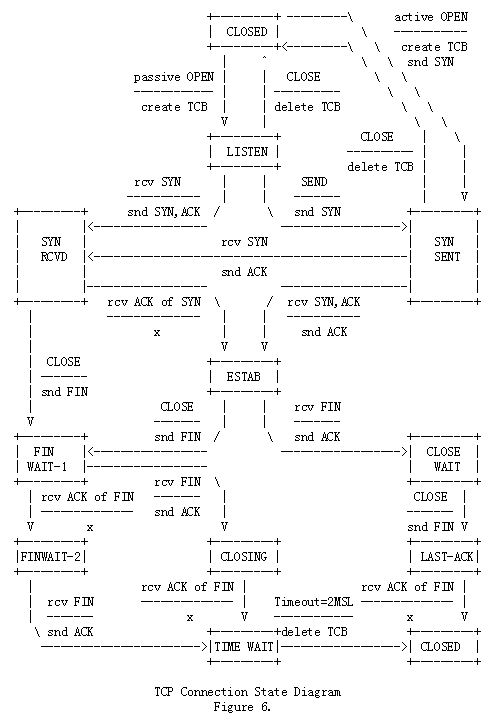
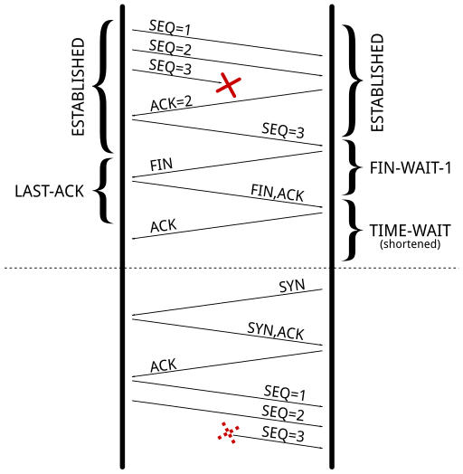

# 在繁忙的服务器上应对TIME-WAIT状态

**参考的链接**

https://vincent.bernat.ch/en/blog/2014-tcp-time-wait-state-linux（原文）

https://www.cnxct.com/coping-with-the-tcp-time_wait-state-on-busy-linux-servers-in-chinese-and-dont-enable-tcp_tw_recycle/（译文）


**目录**

[TOC]

Linux kernel文档中的描述对了解`net.ipv4.tcp_tw_recycle`没有很好的帮助: 

> 开始快速回收`TIME-WAIT`套接字。默认值为0。未经技术专家的建议/要求，不得更改。

`net.ipv4_tcp_tw_reuse`有稍微多一些的描述，但是说法都相同: 

> 从协议角度来看，在安全的情况下，允许将`TIME-WAIT`套接字重新用于新连接。默认值为0。未经技术专家的建议/要求，不得更改。

缺少文档的唯一结果是，我们找到了许多调整指南，建议将这两个设置都设置为1，以减少`TIME-WAIT`状态下的条目数。但是，在tcp(7)手册中，对于面向公众的服务器来说`net.ipv4.tcp_tw_recycle`选项是相当有问题的，它可能不会处理来自同一NAT设备后面的两台不同计算机的连接，这个问题很难发现，等着咬你一口: 

> 开启快速回收`TIME-WAIT`套接字。不建议开机这个选项，因为在使用NAT时这会引起问题。

我将在此处提供更详细的解释，以希望教给互联网上有问题的人。


尽管在其名称中使用了ipv4，但是net.ipv4.tcp_tw_recycle控制也适用于IPv6。

# 关于TIME-WAIT状态

让我们倒退一下，仔细看看这种`TIME-WAIT`状态。它是什么？请参阅下面的TCP状态图: 




<center>相比文章中的原图，我个人更喜欢这张图，感觉更清晰一些</center>

仅首先关闭连接的一方会达到`TIME-WAIT`状态。另一端将遵循一条通常允许快速摆脱连接的路径。

你使用`ss -tan`来查看连接的当前状态: 

```bash
$ ss -tan | head -5
LISTEN     0  511             *:80              *:*     
SYN-RECV   0  0     192.0.2.145:80    203.0.113.5:35449
SYN-RECV   0  0     192.0.2.145:80   203.0.113.27:53599
ESTAB      0  0     192.0.2.145:80   203.0.113.27:33605
TIME-WAIT  0  0     192.0.2.145:80   203.0.113.47:50685
```

## 保持在TIME-WAIT状态的目的

`TIME-WAIT`有两个目的: 

- 最知名的一个是: 防止来自一个连接的延迟数据包被依赖于同一四元组（源地址、源端口、目标地址、目标端口）的后续连接接受。序列号也必须在一定范围内才能被接受。这使问题发生的几率缩小了一些，但是这个问题仍然存在，尤其是在具有较大接收窗口的快速连接上。[RFC1337](http://tools.ietf.org/html/rfc1337	)详细说明列`TIME-WAIT`状态不足时会发生什么。以下是如果不缩短`TIME-WAIT`状态可以避免的示例: 

  

  <center>由于TIME-WAIT状态缩短，因此在不相关的连接中接受了延迟的TCP数据包。</center>

- 其他的目的是确保远端关闭了连接。当最后一个ACK丢失的时候，远端保持在LAST-ACK状态。当没有`TIME-WAIT`状态，则在远端仍认为之前的连接有效时，可以重新打开连接。当远端收到一个SYN时（且sequence number匹配），它将以RST应答，因为它不期望这样的数据包。

  

  <center>因为丢失了最后的ACK，所以远端保持LAST-ACK状态，使用相同的四元组打开一个新连接是无法工作的</center>


RFC793需要`TIME-WAIT的`状态持续时间是MSL时间的两倍（一个MSL时间是30s）。在Linux上，这个时间是不可以更改的，并且在include/net/tcp.h中定义为1分钟。

```c
#define TCP_TIMEWAIT_LEN (60*HZ) /* how long to wait to destroy TIME-WAIT
                                  * state, about 60 seconds     */
```

曾经有人提出将其转换为可调值的提议，但是由于`TIME-WAIT`状态是一件好事而被拒绝。

## TIME-WAIT引起的问题

现在，让我们看看为什么这种状态在处理大量连接的服务器上会令人讨厌。问题包括三个方面: 

- 连接表中占用的slot，用于防止相同类型的新连接（相同四元组）
- 内核中TIME-WAIT套接字结构体的内存占用
- 增加额外的CPU使用率

`SS -tan state time-wait | wc -l`的结果本身，并不能说明上面提到的问题。

### Connection table slot

`TIME-WAIT`状态的连接会在连接表中保持一分钟。这意味着，不能存在其他相同四元组（源地址、源端口

目的地址、目的端口）的连接。

对于web服务器，目的地址和目的端口是不变的。如果你的web服务器在7层负载均衡之后，源地址也会不变（始终为负载均衡的地址）。在Linux中，默认情况下，客户端端口大约有30000个。这个值可以通过调整`net.ipv4_ip_local_port_range`参数调整。这意味web服务器和负载均衡之间每分钟仅可以有30000个ESTABLISHED连接，也就是500连接每秒。

如果`TIME-WAIT`套接字在客户端侧，这中情况可以十分简单的被检测到。调用`connect()`将返回`EADDRNOTAVAIL`并且应用将记录一些错误消息。如果在服务器侧，这会非常复杂，因为没有日志，也没有计数器可依赖。毫无疑问，您应该尝试使用一些明智的方法来列出已使用的四元组的数量（在服务器侧）: 

```bash
$ ss -tan 'sport = :80' | awk '{print $(NF-1)" "$(NF)}' | \
      sed 's/:[^ ]*//g' | sort | uniq -c
    696 10.24.2.30 10.33.1.64
   1881 10.24.2.30 10.33.1.65
   5314 10.24.2.30 10.33.1.66
   5293 10.24.2.30 10.33.1.67
   3387 10.24.2.30 10.33.1.68
   2663 10.24.2.30 10.33.1.69
   1129 10.24.2.30 10.33.1.70
  10536 10.24.2.30 10.33.1.73
```

解决方案是使用更多的四元组，可以通过以下几种方式来完成（以实施难度进行升序排序）: 

- 通过将`net.ipv4.ip_local_port_range`设置的更宽泛来使用更多的客户端端口。
- 通过让web服务器监听在一些额外的端口上（81、82、83、......）来使用更多的服务器端口。
- 通过在负载均衡上配置额外的IP并以轮询方式调度来使用更多的客户端IP。
- 通过在web服务器上配置额外的IP来使用更多的服务器IP。
- 最后一种方式是调整`net.ipv4.tcp_tw_reuse`和`net.ipv4.tcp_tw_recycle`。

### Memory

处理许多连接时，将套接字额外打开一分钟可能会消耗你服务器的一些内存。例如，如果你想每秒处理10000个新连接，你将有600000个（最大）套接字处在`TIME-WAIT`状态。

首先，从应用角度看，`TIME-WAIT`套接字不消耗任何内存: 该套接字已关闭。在内核中，`TIME-WAIT`套接字有三种结构（出于三种目的）: 

1. **hash table of connections**被称为**TCP established hash table**（尽管包含其他状态的连接），用于查找现有连接，例如在收到新的连接时。

   该哈希表的每个bucket都包含处于`TIME-WAIT`状态的连接列表和常规活动连接列表。哈希表的大小取决于系统内存，并在引导时显示: 

   ```bash
   $ dmesg | grep "TCP established hash table"
   [    0.169348] TCP established hash table entries: 65536 (order: 8, 1048576 bytes)
   ```
   
   更改内核启动参数`thash_entries`可以更改这个值。
   
   处于`TIME-WAIT`状态的连接列表中的每个元素都是`tcp_timewait_sock`结构体，而其他状态的类型是`tcp_sock`结构体: 
   
   ````c
   struct tcp_timewait_sock {
       struct inet_timewait_sock tw_sk;
       u32    tw_rcv_nxt;
       u32    tw_snd_nxt;
       u32    tw_rcv_wnd;
       u32    tw_ts_offset;
       u32    tw_ts_recent;
       long   tw_ts_recent_stamp;
   };
   
   struct inet_timewait_sock {
       struct sock_common  __tw_common;
   
       int                     tw_timeout;
       volatile unsigned char  tw_substate;
       unsigned char           tw_rcv_wscale;
       __be16 tw_sport;
       unsigned int tw_ipv6only     : 1,
                    tw_transparent  : 1,
                    tw_pad          : 6,
                    tw_tos          : 8,
                    tw_ipv6_offset  : 16;
       unsigned long            tw_ttd;
       struct inet_bind_bucket *tw_tb;
       struct hlist_node        tw_death_node;
   };
   ````

2. **连接列表集**（称为“death row”）用于使连接处于`TIME-WAIT`状态。它们由到期前剩余的时间排序。

   它使用与连接哈希表中条目相同的内存空间。这是`struct inet_timewait_sock`的`struct hlist_node tw_death_node`成员。

3. **绑定端口的哈希表**，包含本地绑定端口和关联的参数，用于确定在动态绑定的情况下侦听给定端口或找到可用端口是否安全（用来确保当前端口没有被使用的）。 该哈希表的大小与连接的哈希表的大小相同：

   ```bash
   $ dmesg | grep "TCP bind hash table"
   [    0.169962] TCP bind hash table entries: 65536 (order: 8, 1048576 bytes)
   ```

   Each element is a `struct inet_bind_socket`. There is one element for each locally bound port. A `TIME-WAIT` connection to a web server is locally bound to the port 80 and shares the same entry as its sibling `TIME-WAIT` connections. On the other hand, a connection to a remote service is locally bound to some random port and does not share its entry.

   We are only concerned by the space occupied by `struct tcp_timewait_sock` and `struct inet_bind_socket`. There is one `struct tcp_timewait_sock` for each connection in the `TIME-WAIT`state, inbound or outbound. There is one dedicated `struct inet_bind_socket` for each outbound connection and none for an inbound connection.

   A `struct tcp_timewait_sock` is only 168 bytes while a `struct inet_bind_socket` is 48 bytes:

   ```bash
   $ sudo apt-get install linux-image-$(uname -r)-dbg
   [...]
    gdb /usr/lib/debug/boot/vmlinux-$(uname -r)
   (gdb) print sizeof(struct tcp_timewait_sock)
   1 = 168
   (gdb) print sizeof(struct tcp_sock)
   2 = 1776
   (gdb) print sizeof(struct inet_bind_bucket)
   3 = 48
   ```

   If you have about 40,000 inbound connections in the `TIME-WAIT` state, it should eat less than 10 MiB of memory. If you have about 40,000 outbound connections in the `TIME-WAIT` state, you need to account for 2.5 MiB of additional memory. Let’s check that by looking at the output of `slabtop`. Here is the result on a server with about 50,000 connections in the `TIME-WAIT` state, 45,000 of which are outbound connections:

   ```bash
   $ sudo slabtop -o | grep -E '(^  OBJS|tw_sock_TCP|tcp_bind_bucket)'
     OBJS ACTIVE  USE OBJ SIZE  SLABS OBJ/SLAB CACHE SIZE NAME                   
    50955  49725  97%    0.25K   3397       15     13588K tw_sock_TCP            
    44840  36556  81%    0.06K    760       59      3040K tcp_bind_bucket
   ```

   There is nothing to change here: the memory used by `TIME-WAIT` connections is **really small**. If your server need to handle thousands of new connections per second, you need far more memory to be able to efficiently push data to clients. The overhead of `TIME-WAIT` connections is negligible.

### CPU

On the CPU side, searching for a free local port can be a bit expensive. The work is done by the [`inet_csk_get_port()` function](https://elixir.bootlin.com/linux/v3.12/source/net/ipv4/inet_connection_sock.c#L104) which uses a lock and iterate on locally bound ports until a free port is found. A large number of entries in this hash table is usually not a problem if you have a lot of outbound connections in the `TIME-WAIT` state (like ephemeral connections to a *memcached* server): the connections usually share the same profile, the function will quickly find a free port as it iterates on them sequentially.


# 其他解决方法

如果你在阅读完上面的章节后，仍然对`TIME-WAIT`状态的连接存在疑问，可以通过以下三种其他解决方案来解决: 

- disable socket lingering（禁用套接字延迟关闭）
- `net.ipv4.tcp_tw_reuse`
- `net.ipv4.tcp_tw_recycle`


## Socket lingering

当`close()`被调用，套接字需要延迟关闭（lingering），任何在kernel buffer中剩下的数据都将在后台中发送，并且这个套接字最终将转换为`TIME-WAIT`状态。应用可以立即继续工作，并假设所有数据将最终被安全的传递。

但是，应用程序可以选择禁用此行为，即套接字延迟。这有两种风格：

1. 第一种，调用`close()`之后，套接字发送缓冲区中的任何剩余数据都将被丢弃，而不是按照正常的四步断开来顺序关闭，该连接将通过`RST`关闭（因此，对等方将检测到错误），并将立即销毁。在这种情况下，没有TIME-WAIT状态。
2. 第二种，调用`close()`之后，如果套接字发送缓冲区中仍有任何数据剩余，则该进程进入休眠状态，直到所有数据发送完毕且对等方确认所有数据已收到，或者配置的延迟计时器到期。通过将套接字设置为非阻塞，进程可能不会休眠。在这种情况下，相同的过程在后台发生。它允许在配置的超时期间发送剩余的数据，但是如果成功发送了数据，则会运行正常的关闭序列，您将获得`TIME-WAIT`状态。其他异常情况下，客户端将会收到`RST`的连接关闭信号，同时，服务端残留数据会被丢弃。

在这两种情况中， **disabling socket lingering**不是一个万能的解决方案。但在HAproxy,Nginx（反代）场景中，在TCP协议上层的应用上（比如HTTP），比较合适。同样，也有很多无可厚非的理由不能禁用它。

## net.ipv4.tcp_tw_reuse

`TIME-WAIT`状态可以防止在不相关的连接中接受延迟的数据包。但在某些特定条件下，很有可能出现，新建立的TCP连接请求包，被老连接（同样的四元组，暂时还是`TIME-WAIT`状态，回收中）误处理。

[RFC1323](https://tools.ietf.org/html/rfc1323)提出了一组TCP扩张，以保证网络繁忙状态下的高可用。除了其他事项以外，新的TCP选项会携带两个四字节的timestamp字段。The first one is the current value of the timestamp clock of the TCP sending the option while the second one is the most recent timestamp received from the remote host.（第一个是TCP发送方的当前时钟时间戳，而第二个是从远程主机接收到的最新时间戳。）

通过开启`net.ipv4.tcp_tw_reuse`，如果新的时间戳大于之前连接记录的最新时间戳，那么Linux将会为一个新的出向连接重新使用一个处于`TIME-WAIT`状态的现有连接。

处于`TIME-WAIT`状态的出向连接可以在一秒钟后重新使用。

**如何确保通讯的安全性？**

`TIME-WAIT`状态的第一个目的是避免在不相关的连接中接受重复的数据包。由于使用了时间戳，这样重复的数据包将带有过期的时间戳，因此将被丢弃。

第二个目的是确保远端（对upstream服务器来说，负载均衡就是远端，对负载均衡来说，客户端就是远端）没有因为丢失最后的`ACK`而处在`LAST-ACK`状态。如果ACK丢失，name远端将重传FIN端，直到它

- 放弃（并断开连接）
- 收到正在等待的`ACK`（并断开连接）
- 收到一个`RST`（并断开连接）

如果及时收到了`FIN`段 ，本端的套接字仍将处在`TIME-WAIT`状态，并且将发送期望`ACK`包。

一旦新的连接替换了`TIME-WAIT`条目，新连接的`SYN`包将被忽略（由于时间戳记），也不会响应`RST`，只能通过重新传输`FIN`包来响应。FIN包收到一个`RST`应答(因为本地连接处于`SYN-SENT`状态)，该`RST`包会让远端从`LAST-ACK`状态转换出来。最初的`SYN`包将会被重发(1秒后)，然后完成连接的建立。这看起来没有啥错误发生，只是延迟了一下: 


<center>如果由于丢失了最后一个`ACK`而使远端保持`LAST-ACK`状态，则当本端转换到`SYN-SENT`状态时，将重置远程连接</center>

应该注意的是，当一个连接被重用时，`TWRecycled `计数器会增加(见/proc/net/netstat 中TWRecycled的值)。

## net.ipv4.tcp_tw_recycle

此机制还依赖于timestamp选项，但会同时影响出向和入向连接，这通常在服务器首先关闭连接时很方便（linux上tcp_timestamps默认开启）。

`TIME-WAIT`状态将提前终止: 它将根据RTT及其方差计算的重传超时（RTO）间隔后将其删除。您可以使用ss命令找到活动连接的适当值: 

```bash
$ ss --info  sport = :2112 dport = :4057
State      Recv-Q Send-Q    Local Address:Port        Peer Address:Port   
ESTAB      0      1831936   10.47.0.113:2112          10.65.1.42:4057    
         cubic wscale:7,7 rto:564 rtt:352.5/4 ato:40 cwnd:386 ssthresh:200 send 4.5Mbps rcv_space:5792
```

Linux将会放弃所有来自远程端的timestramp时间戳小于上次记录的时间戳（也是远程端发来的）的任何数据包。除非`TIME-WAIT`状态已经过期。

```C
if (tmp_opt.saw_tstamp &&
    tcp_death_row.sysctl_tw_recycle &&
    (dst = inet_csk_route_req(sk, &fl4, req, want_cookie)) != NULL &&
    fl4.daddr == saddr &&
    (peer = rt_get_peer((struct rtable *)dst, fl4.daddr)) != NULL) {
        inet_peer_refcheck(peer);
        if ((u32)get_seconds() - peer->tcp_ts_stamp < TCP_PAWS_MSL &&
            (s32)(peer->tcp_ts - req->ts_recent) >
                                        TCP_PAWS_WINDOW) {
                NET_INC_STATS_BH(sock_net(sk), LINUX_MIB_PAWSPASSIVEREJECTED);
                goto drop_and_release;
        }
}
```

当远程端主机HOST处于NAT网络中时，时间戳在一分钟之内（MSL时间间隔）将禁止了NAT网络后面，除了这台主机以外的其他任何主机连接，因为他们都有各自CPU CLOCK，各自的时间戳。这会导致很多疑难杂症，很难去排查，建议你禁用这个选项。另外，对方上TCP的`LAST-ACK`状态是体现本机`net.ipv4.tcp_tw_recycle`的最好数据。

从Linux 4.10开始，Linux将随机化每个连接的时间戳偏移，无论是否使用NAT，使此选项都会完全失效。它已从Linux 4.12完全删除。

`LAST-ACK`状态的处理方式与`net.ipv4.tcp_tw_recycle`完全相同。

# 总结

最合适的解决方案是增加更多的四元组数目，比如，服务器可用端口，或服务器IP，让服务器能容纳足够多的TIME-WAIT状态连接。在我们常见的互联网架构中（NGINX反代跟NGINX，NGINX跟FPM，FPM跟redis、mysql、memcache等），减少`TIME-WAIT`状态的TCP连接，最有效的是使用长连接，不要用短连接，尤其是负载均衡跟web服务器之间。尤其是[链家事件中的PHP连不上redis](http://zhi.hu/oRZK)

在服务器侧，不要开启`net.ipv4.tcp_tw_recycle`，除非你很确定没有位于NAT设备后面的客户端连接。开启`net.ipv4.tcp_tw_recycle`对入向连接无用。

在客户端（尤其是服务器上，某服务以客户端形式运行时，比如上面提到的nginx反代，连接着redis、mysql的FPM等等）上启用`net.ipv4.tcp_tw_reuse`，还算稍微安全的解决`TIME-WAIT`的方案。再开启`net.ipv4.tcp_tw_recycle`的话，对客户端（或以客户端形式）的回收，也没有什么卵用，反而会发生很多诡异的事情（尤其是FPM这种服务器上，相对nginx是服务端，相对redis是客户端）。

此外，在设计协议时，请勿让客户先关闭。客户无需处理`TIME-WAIT`状态，将责任推给更适合处理此问题的服务器。

最后是W. Richard Stevens在《UNIX网络编程》中的一句话：

The TIME_WAIT state is our friend and is there to help us (i.e., to let old duplicate segments expire in the network). Instead of trying to avoid the state, we should understand it.

`TIME_WAIT`状态是我们的朋友，它会帮助我们（比如，让重复的数据包在网络中到期）。与其尝试避免这个状态，我们更应该了解它。